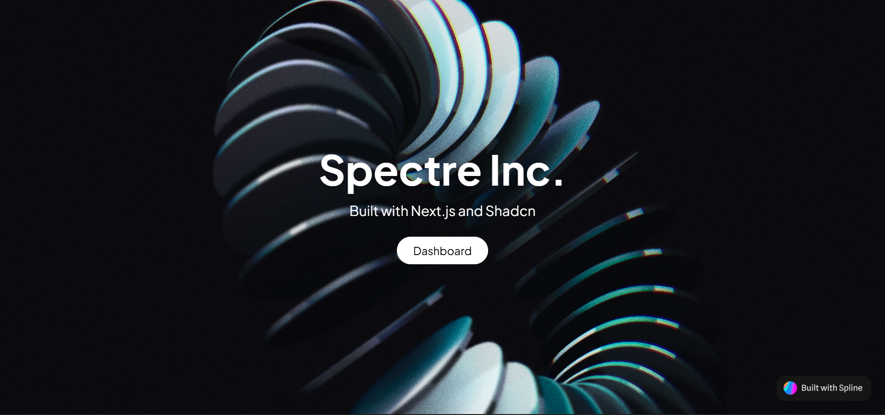
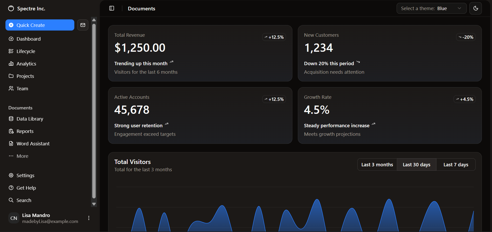
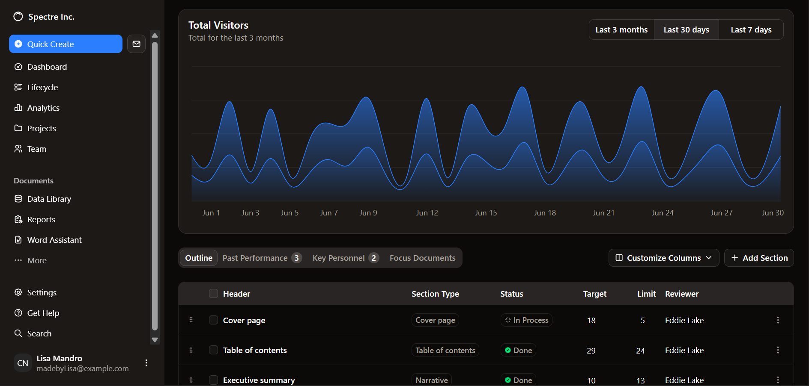

# Spectre Inc Finance Dashboard
Spectre Inc is a visually immersive finance-themed dashboard built with Next.js 15, TypeScript, and Tailwind CSS v4, featuring a 3D animated landing page crafted in Spline. Click the Dashboard button to transition from the 3D landing scene into a modern, responsive analytics hub, complete with **light/dark mode switching** and **theme selection** for you to personalize your workspace to match your style. 
   

     
     

  

  

  
  
  
  
## Tech Stack
- **Next.js 15** – Core framework  
- **TypeScript** – Type safety  
- **Tailwind CSS v4** – Utility-first styling  
- **Shadcn UI** – Component library  
- **Spline** – 3D interactive landing page
 

-----------------------------------------------
💡 If this project taught you something new, or sparked an idea, why not be part of it?  
   Fork it, tweak it, break it (and fix it 😄), your creativity is welcome here. 
  
